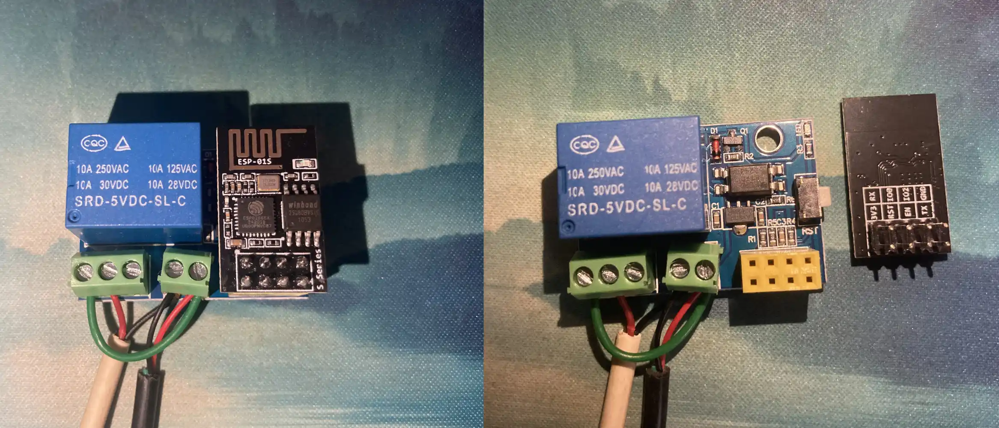
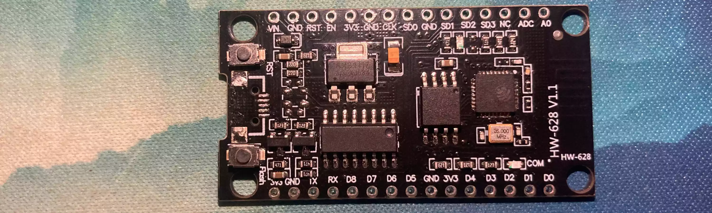
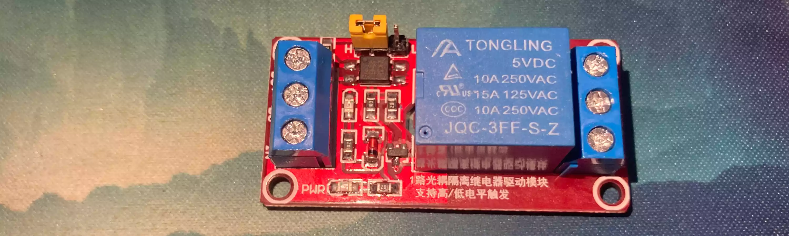
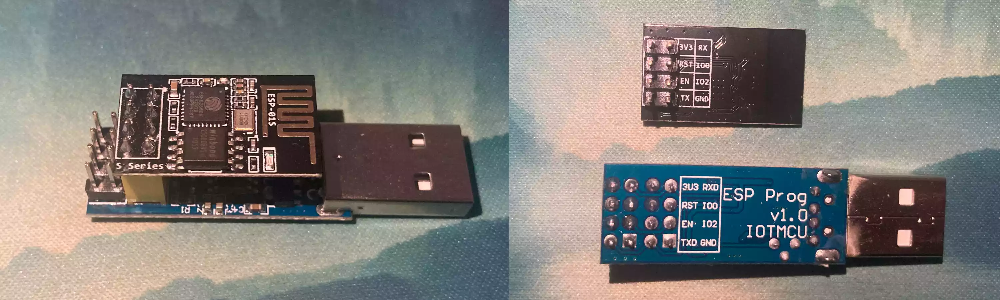
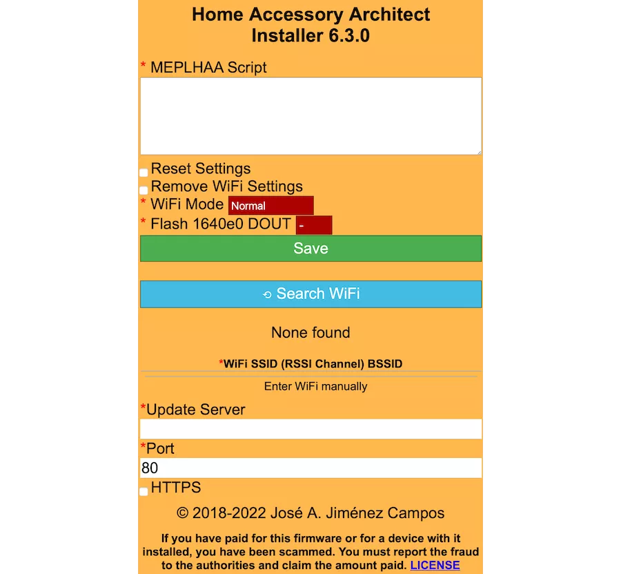
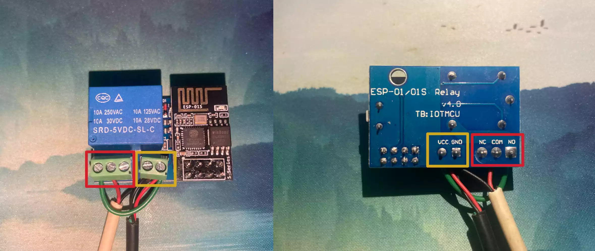
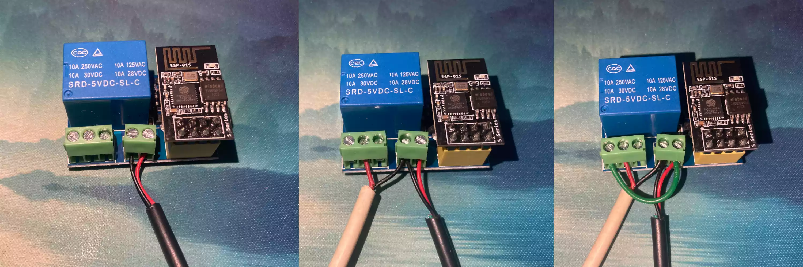

买量产好的继电器，简单接线后当个显示器背光灯 [演示视频](https://t5d.trle5.xyz/Video/relay-backlight.mp4) <sup>H.265 注意</sup>

**⚠ 注意：此教程涉及电路，请注意人身安全**

|| 不过本教程里用的都是 DC 5V，应该也没什么大危险 ||

## 介绍

这个开关由 esp 8266-01s 与 DC 5V 继电器组合而成，为量产产品，不需要自己手动焊元件，找一些线简单接一下就行

可从题图看到，这个继电器支持的控制电流为 DC 5V，继电电流有 DC 28/30V 10A 和 AC 125/250V 10A 各四个限制<sup>也许是？</sup>，但这种东西用来控制点小电器就行了，请不要作死去测它的极限...

> 继电器是什么？工作原理呢？[继电器工作原理详解 - MCU 中文技术社区](https://mcu.eetrend.com/content/2019/100045397.html)

其实也不用太详细了解继电器的工作原理，只用知道它可以用一个小电压来控制大型电器的开关就行

这个量产好的开关不用你自己担心要怎么把模块和继电器连接起来，你只需要接好供电和需要控制的线路就行，很方便


## 需要的材料

**用量产模块**


- esp8266 继电器

分别是组合起来和分开的图（线懒得拆，直接拍照了<sup>虽然后面还是拆了</sup>）



带 esp8266－01s 的继电器淘宝均价在 ￥12 左右

- CH340C 烧录下载器


这个烧录器的价格在 ￥6~10 左右，单独的话买不太值这个价

如果你自己有办法给模块刷进固件的话，可以不花这个钱

- 线材若干

有多余的坏头数据线也可以把它剪了拿来用


**自己拼继电器**

如果你手头有单独的模块，也可以自己接，但我自己接的好像不怎么好用

- esp 8266 模块 

这个的供电 Micro USB 接口插拔太多次导致松动，掉下来了

- 可由 DC 5V 电流控制的继电器 

虽然这里有展示，但后面不会讲这个，因为拼起来用了不太稳定，放到路由器旁边都有时会没响应


**用于刷写固件的设备**

本教程将把这个模块接入到 Apple 的 HomeKit 来控制，因此你的手上最好有台 iOS 10 以上支持 **家庭** 应用的 Apple 设备

至于为什么不接入更通用的 [Home Assistant](https://www.home-assistant.io/) 呢？

|| 因为还不会搞，而且家里没有能跑 Home Assistant 的开发板或手机，后面如果学会了也会补上的 ||

为给 esp8266 刷入固件，你需要拥有一台电脑或支持 OTG 功能的手机，我这里推荐拿手机刷，因为似乎不需要装驱动

**烧录软件与 HAA 固件**

ESP8266 Loader: [**Play Store**](https://play.google.com/store/apps/details?id=com.bluino.esploader) | [**Hubert's Box**](https://t5d.trle5.xyz/Apk/esp8266loader.apk)

HAA 固件: [**Home Accessory Architect**](https://github.com/RavenSystem/haa/releases/latest) | [**Hubert's Box**](https://t5d.trle5.xyz/haa_updates/)

HAA 固件我推荐选择只需使用一个文件的 `fullhaaboot.bin` 二进制固件，因为 **ESP8266 Loader** 只能一次性刷入一个二进制固件


## 配置固件

首先得把模块和烧录器连接起来，参考下面的图片，担心接错也可以核对一下针脚再连接



### 刷入固件

确定连接正常后，打开 **ESP8266 Loader**，点击主页右侧的文件名，然后选择刚才下载的 `fullhaaboot.bin` 二进制固件，点击右侧的上传按钮写入模块，稍加等待它写入固件，完成后手机上会有提示

至于 PC 嘛，刷写工具用 [**NodeMCU Flasher**](https://github.com/nodemcu/nodemcu-flasher) 或 [**NodeMCU PyFlasher**](https://github.com/marcelstoer/nodemcu-pyflasher) 都行，毕竟难点在于装驱动

还是得说说 PC 装驱动的问题，虽然模块用的芯片都是 esp8266，但驱动可能会分好多种，问店家客服或者自己找吧...

### 配置 WiFi 与脚本

刷写固件完成后，请将模块重启一遍，然后打开手机或其他可使用 WLAN 功能的设备，查看可用的 WiFi 列表，不出意外可以找到一个名为 `HAA-ABCDEF` 格式的开放 WiFi 网络，连接它，然后打开浏览器，访问 [192.168.4.1:4567](http://192.168.4.1:4567/) 页面

没有问题的话，你的浏览器会加载出一个橘黄色的网页，如下图所示 

图片来源: [Setup Mode - RavenSystem/esp-homekit-devices](https://github.com/RavenSystem/esp-homekit-devices/wiki/Setup-Mode) 进行过透明像素调整以适合比例

此时可以看到标题下面有个 **MEPLHAA Script** 输入框，不用着急，先点击下方的 **Search WiFi**，找到你家里用的网络，选中并输入密码，再回到上方填写 `json` 脚本

**注意模块仅支持 2.4GHz 频率的 WiFi 网络，但如果你的路由器有 2.4/5GHz 双频 WiFi 功能的话，模块接 2.4GHz，手机连接 5GHz 的网络也是可以控制开关的**

至于 **MEPLHAA Script** 框里要填什么东西，这里我就直接搬 [**自制 HomeKit 智能开关**](https://www.jianshu.com/p/9cf083830edf) 这篇文章的脚本过来了

```json
{
  "c": { "l": 1, "b": [{ "g": 2, "t": 5 }] },
  "a": [{
    "t": 1,
    "s": 1,
    "0": { "r": [{ "g": 0, "v": 1 }] },
    "1": { "r": [{ "g": 0, "v": 0 }] },
    "b": [{ "g": 2 }]
  }]
}
```

就是一个极其简单的开关，如果说有哪里要修改的话，就是第五行的 `"s": 1`，这代表模块通电后开关状态默认为开，改为 `0` 后默认为关，有能力的请查看 [**Home - RavenSystem/esp-homekit-devices**](https://github.com/RavenSystem/esp-homekit-devices/wiki) 自行配置

### 等待 OTA 升级

按照你的想法配置好 json 后，点击 **Save** 按钮，接下来就是要等待它自己完成安装了，你需要给它找一个~~凉快~~ WiFi 信号好的地方，以及一个稳定的供电，至于模块插在烧录器还是继电器上都没问题，供电稳定既可

**⚠️ 注意：HAA 安装过程需要连接到 GitHub 进行 OTA 升级，请确保你的家庭网络足够通畅，也可以按照** [__Using a custom server for OTA updates__](https://github.com/RavenSystem/esp-homekit-devices/wiki/Installation#using-a-custom-server-for-ota-updates) **教程来自行配置 OTA 服务器**

我按照教程在 [**t5d**](https://t5d.trle5.xyz) 上建了一个自定义 OTA 文件夹，文件托管在 Vercel 的 HK 区域服务器上，~~理论可用，但我还没有测试过~~ 

已测试，可用：[**t5d.trle5.xyz/haa_updates**](https://t5d.trle5.xyz/haa_updates)，需要修改端口号为 `443` 并勾选 **HTTPS** 复选框

接下来就是等待 OTA 完成，理想情况下大致十分钟左右就可以配置完成并开始等待配对，不确定它安装成功没有的话，可以进入 **ESP8266 Loader**，点击右上角的 **Serial Monitor** 按钮<sup>菜单旁边那个</sup>查看它的 log 以排查是哪里出了问题


## 连接 HomeKit

|| 似乎是全文最轻松的部分？ ||

确保你的模块已 OTA 成功，接下来拿出你的 iPhone，打开 **家庭** 应用，点击右上角的 + 号，选择 **添加或扫描配件**，再点击 **我没有或无法扫描代码**，就能看到名为 `HAA-ABCDEF` 格式的开关，点击它并连接

**HAA 固件的 HomeKit 设置代码统一为：`0218-2017`**

连接过程会提示 **未认证配件**，不用理会继续点击 **仍然添加** 既可，没有什么影响

接下来会要求你配置这个开关在哪个房间，显示为 **灯**、**风扇** 或 **开关**，请根据实际用途调整，后面也可以随时修改

普通测试一下开关能否点击且可响应，之后就可以断电并开始接线了


## 接线

**这里我的使用例是把整个模块用在一条 USB-A 延长线上，用来控制一些例如灯条的小电器**


### 供电电路

接下来把模块接到继电器上，将 5V 的供电线接到模块右边橘黄色框里的两个供电接线端子，从正面来看，左边是 `GND(-)`，右边是 `VCC(+)`，不放心的话请自己看看继电器的 PCB 有没有标识正负极，确定没有问题后再接上供电



此处黑色线为供电，白色线为输出，还有一条粗的绿色线用于连接正极电流到常开端口

**⚠️ 注意：橘黄色框里的为模块供电接口，请勿接入高于 5V 的直流电，更不要接入交流电，可能会损坏模块甚至产生危险**

红框内的三个接口按左侧图片从左到右的排序分别是 **常开端** | **公共端** | **常闭端**，具体闭合情况请参考下面

| 是否有供电 | 常开与公共闭合 | 常闭与公共闭合 |
|:---:|:---:|:---:|
| 是 | 是 | 否 |
| 否 | 否 | 是 |

接上供电后，继电器会快速吸放一次，然后就可以看到继电器上的 LED 灯亮了，此时开关默认为打开状态，进入 **家庭** 应用查看，等待模块连上 WiFi 后就可以用手机控制继电器了 🎉


### 继电电路

接下来是继电电路的连接方式，至于怎么接线，看看普通电器是怎么供电的就行了，无论是交流电 AC 还是直流电 DC，都需要连接正负极，少哪边都不行，那我们只需要控制正负极其中一条线的通或否既可

这里我是将它作为一条可开关的 USB 延长线，也就是继电电压与供电电压一致，线分为输入部分和输出部分，我只需要使用它来控制输出部分的线就可以当成开关来使用了



首先把供电按照正负极接入 `GND(-)` 和 `VCC(+)`，暂时先不要拧上接线端子

再把输出的 **负极** 与供电的 **负极** 接在一起，**正极** 则接到左侧的 **公共端** 里，此时 **公共端** 与 `GND(-)` 就可以拧紧了

最后找一条短线把 **常开端** 与供电 **正极** 接起来既可拧紧所有接线端子，至于 **常闭端** 暂时还用不到

接好线后，连接好输出端的负载设备，再连接供电插头，自己测试一下吧 🥳