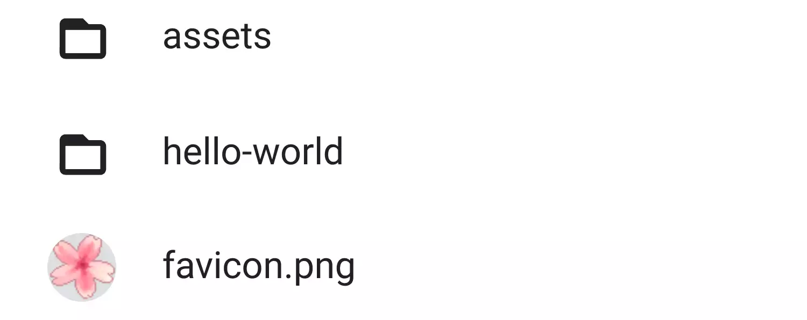
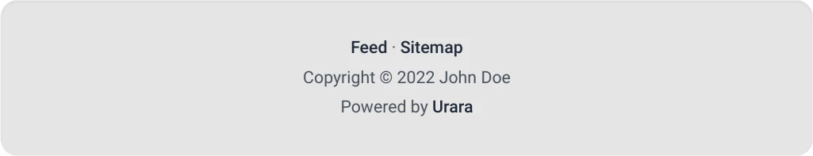
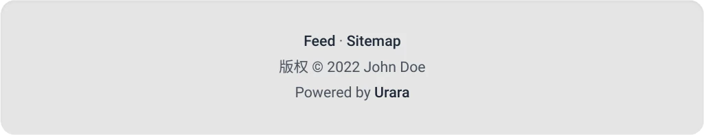
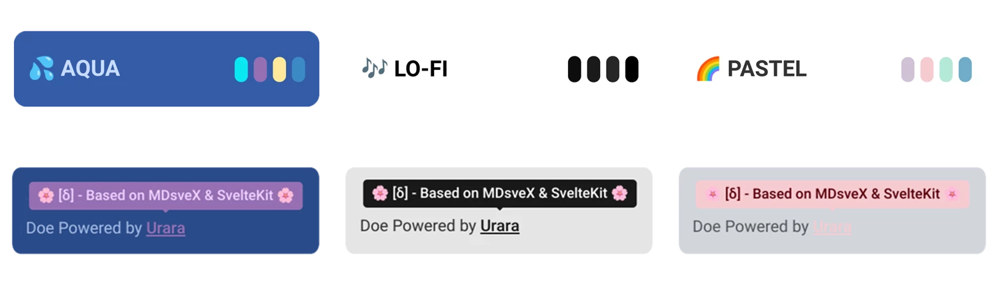
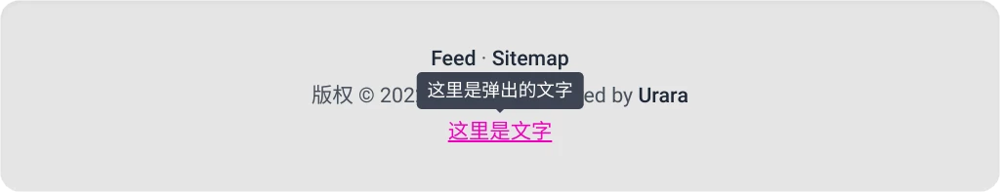

<script>
  import Alert from '$lib/components/extra/alert.svelte'
</script>

题图来自 [Urara demo](https://urara-demo.netlify.app/) 并进行过圆角填充

**填坑写文章咯 😇** 

## 介绍 Urara

**什么是 Urara？**

如果你在我的网站上看到了这篇文章，那么你现在浏览的这个网页就是基于 Urara 搭建的，不过这个网站被我改的地方有点多，可以 [**点击这里**](https://urara-demo.netlify.app/) 看看官方 demo，以及 [**官方入门教程**](https://urara-docs.netlify.app/) 

简单来说，Urara 是一个博客模板，如果你看过我之前写的 [**搭建一个自己的博客**](/post/搭建一个自己的博客/) 文章的话，就可以看出 Urara 似乎和 Hexo 差不多，也是写完文章交给它就可以生成博客网页的程序，不过他们的差距有点大，从外观和内部技术来说都有很大差距

至于我为什么要从 Hexo 换到 Urara 呢？其实就是个人喜好，如果你目前在用 Hexo，而且还用了一堆主题和插件，你迁移到 Urara 的话会失去你使用的所有主题和插件，也得重新习惯 Urara 的后端结构

当然选择权在你自己手上，想怎么折腾就怎么折腾 😆

下面会先教如何在自己的机器上部署一个官方 demo，再细说想改哪些地方要去改哪个文件，要怎么改，以及一些会遇到的坑

## 搭建 Urara demo

### 配置环境

**首先我们需要安装 Node.js**

**node 与 nodejs 是同一个东西，我也不清楚为什么会这样，我现在虚拟机中 node 的版本号为 `v12.22.12`，nodejs 为 `v16.18.0`**

Urara 需要 `nodejs` v16.x 以上版本，但在我的 Linux 虚拟机中使用 `apt` 安装 `node` 只能安装到 `12.22.12` 版本，想升级的话需要通过 `npm` 安装 `n` 软件包（名字就是一个 n ），如果你的 Linux 发行版能直接装到 16.x 版本的话，可以跳过这一步了

```bash
sudo apt install nodejs # 如果提示找不到包可以试试替换为 node
# nodejs 可能会附带安装 npm，如果有的话可以跳过下面那句命令
sudo apt install npm
nodejs -v ; npm -v # 查看它们的版本号
```

如果执行上面命令最后一句后第一行显示出的版本号低于 v16 的话，就需要进行升级了

```bash
npm install -g n # 安装 n 软件包
n stable # 使用 n 程序把 nodejs 升级到 stable 渠道
npm install npm@latest -g # 升级 `npm` 包管理器（可选）
```

安装完再测试一下版本号，正常的话就可以安装其他需要的软件了

**其次是安装 pnpm**

Urara 使用 [pnpm](https://pnpm.io/) 包管理器进行组件安装，~~所以这个软件包是必须安装的~~，非必要，如果你有其他的方法安装组件和运行开发服务器的话

```bash
npm i -g pnpm # 这个是官方文档里的安装办法
```

安装完成后，运行 `pnpm -v` 看看版本号，截至到文章修改日期，pnpm 最新版本号为 `7.17.0`

**接下来就是克隆仓库，可以使用 `git` 或按照官方教程使用 `degit`**

```bash
sudo apt install git # 已经安装过 git 的话就不要重新安装了
git clone https://github.com/importantimport/urara
```

另一个办法

```bash
npx degit importantimport/urara urara
# 新建一个名为 urara 的文件夹并把项目克隆到里面去
```

这两种方法的差别就是用 `git` 克隆会保留原本的 git 信息和一些其他许可证文件，而使用 `degit` 并不会保留这些信息

也就是说你使用 `git` 克隆下来的话要手动删掉 `.git` 文件夹并根据你自己的想法修改许可证等文件，而使用 `degit` 不用删，但你依然得手动来搞

### 开启本地测试服务器

首先，切换到目录并安装拓展

```bash
cd urara # 也可根据你的项目名
pnpm i # 根据文件夹内的 package.json 和 pnpm-lock.yaml 按照需要的拓展
```

如果没有意外，那么安装过程会顺利的跑完，~~网络条件可不算意外~~，接下来就可以完成最后一步了

```bash
pnpm dev
```

运行命令后静候一段时间，当然这个时间长短要看设备，打开你设备上的浏览器，在地址栏输入 `127.0.0.1:5173` 并按下回车，直到屏幕被清屏，输出以下内容

```text
  VITE v3.2.4  ready in 147 ms

  ➜  Local:   http://127.0.0.1:5173/
  ➜  Network: use --host to expose
 
🌼 daisyUI components 2.40.1  https://github.com/saadeghi/daisyui
  ✔︎ Including:  base, components, themes[29], utilities
```

等待加载完成后即可看到 Urara 的 demo 已经在你的本地设备上跑起来了 🎉

注意请使用较新的浏览器，使用过时的浏览器可能会导致渲染错误以及一些其他 bug

**搭建完成后，接下来就是根据你自己的想法来修改博客了**

与 Hexo 相同，您可以在运行本地测试服务器的同时修改源文件以查看变化，不过并不是所有源文件的修改都可以事实相应，如果没有变化，可以试试重新开启测试服务器

## 自定义博客

|| 改改改，但不要把改好的东西搞没了 ||

### 文章与目录

Urara 的后端结构大致分为 `src` 与 `urara` 文件夹，其中 `src` 文件夹存储了绝大多数的配置文件， `urara` 文件夹为存放图片资源与 [Markdown](https://markdown.com.cn/basic-syntax/) 格式文件的地方，首先来讲一下如何编排文章目录

#### 文章目录编排

打开其中的 `urara` 目录，你会看到两个文件夹与一张图片，第一个文件夹 `assets` 中也有几张图片，它们是 demo 自带的资源，我也不清楚哪里会用的到，自己琢磨要不要删除吧



还有另一个 `hello-world` 文件夹，点进去可以看到两个文件夹、一张图片和一个名为 `+page.svelte.md` 的文件，再打开其中的 `toc-disabled` 文件夹，能看到另一个名为 `+page.md` 的文件

至于它们是什么关系嘛，~~`+page.svelte.md` 为启用了 svelte 特性的 Markdown 文档，而 `+page.md` 则是常规的 Markdown 文档，我不太懂 svelte，就不介绍了 😥~~

跟作者交流了一下，并没有上面所说的差别，只是为了方便自己辨认

看到这里不知道你有没有看出来，这里的 Markdown 文档除了名为 `+page.svelte.md` 就是名为 `+page.md`，~~这其实也是 Urara 的命名要求~~ 是 SvelteKit 的要求，这个与 Hexo 的逻辑有些差别，需要适应

那怎么把文章放在对应的目录呢，其实看看文件浏览器的地址栏就知道了

**Urara 是把文件夹当目录，像这个 demo 的 `urara` 资源文件夹里有一个 `hello-world` 文件夹，那么在构建和测试时，软件会自动检测这个文件夹里的 `.md` 文件，并生成可访问页面，这个页面对应的目录就是 `127.0.0.1:5173/hello-world`，其中还有 `elements` 文件夹，那么对应的目录就是 `127.0.0.1:5173/hello-world/elements`**

如果你发现你设定好的文件夹里有 `+page.md` 或 `+page.svelte.md` 文件，但测试访问的时候发现页面却是空白的，那你就要注意一下是不是这个文件夹根目录里有一个以上这种文件了，出现这种情况就是软件不知道应该选择哪个文件来生成页面导致的

#### 文章格式设置

文件夹里的目录也不是随便写点文字丢进去就可以直接生成的了，首先得写文档头，再按照 Markdown 的格式写文章

> 不会写 Markdown？很简单，来看 [Markdown 官方教程](https://markdown.com.cn/basic-syntax/) 

首先我在这里放一个文档头

```markdown title="+page.md"
---
title: 'Urara 入门教程' // 此为文章的标题
layout: 'article' // @ 文章类型，用于 IndieWeb
created: 2022-11-20 // 文章创建时间，可在博客主页文章标题上方看到
updated: 2022-11-20 // @ 文章更新时间，把鼠标放在文章创建时间上即可看到
published: 2023-01-05 // @ 文章发布日期，如果设定了，此日期会替换创建日期作为文章默认显示日期
image: /post/urara-intro/urara.webp // @ 题图，会在主页作为文章卡片的底图，进入文章后将在文章标题下方显示
tags: // @ 标签，即用来说明文章包含哪些部分的东西，会在桌面端主页右侧显示，移动端平排在个人资料下方
   - Urara
   - 技术
   - 博客 // 只要遵循这个标签格式，可以一直添加
in_reply_to: // 回复提示，代表这篇文章是用来回复某个链接的
- 'https://example.com/post123'
- 'https://example.com/post456' // 遵循这个标签格式，也可以一直添加
summary: '力所能及写的搭建教程' // @ 概括语句，会显示在主页文章卡片下方看到，进入文章后会被隐藏
flags: // @ 文章选项
  - unlisted // @ 添加此选项后文章不会出现在主页
---
```

上面里面以 @ 开头的注释表示这个部分并非必须内容，为演示，下面再放一个最简单的文档头

```markdown title="+page.md"
---
title: '测试页面' // 标题
created: 2000-01-01 // 创建时间
---
```

其实你想的话全部都能忽略掉，文章目录会代替标题中的文章名，时间线也会乱

**如果不留日期，似乎还可以达成置顶文章的效果？**

Urara 的文件头目前兼容 [**FFF 0.3**](https://fff.js.org/version/0.3.html)，以上的内容只经过我简单的测试，可能还有其他选项可用

### 博客风格自定义

接下来就是修改例如个人资料、标题和页脚之类的东西了，对于没什么代码知识的人可能会觉得非常难搞，加油 😇

#### 博客标题以及个人资料卡片

<Alert status="warning" title="目前 Urara 启用了 imagetools 优化头像，这暂时修改了设定头像的路径"/>

如需修改头像，请把下方文件中的 `/static/assets/maskable@512.png` 替换成您头像的路径

```ts title="src/lib/components/index_profile.svelte" {2,3}
<script lang="ts">
  import { site } from '$lib/config/site'
  import { src, width, height } from '/static/assets/maskable@512.png?width=384&format=webp&metadata'
  import srcset from '/static/assets/maskable@512.png?w=48;96;192&avif&srcset'
</script>
⬇️6
```

您也可以进行还原到启用 imagetools 前的 [**commit:e05c757**](https://github.com/importantimport/urara/commit/284d74b7cfeb9a6e25f874877d8998724d7eb84a) 来暂时禁用它

```bash
git reste 284d74b7cfeb9a6e25f874877d8998724d7eb84a
```

也就是博客的名称和主页左边那块，我们需要修改 `src/lib/config/site.ts` 文件，依然是使用本站的文件作为示例

```ts title="src/lib/config/site.ts"
import type { SiteConfig } from '$lib/types/site'

export const site: SiteConfig = {
  protocol: 'https://', // 选择博客传输协议，http 或 https
  domain: import.meta.env.URARA_SITE_DOMAIN ?? 'trle5.xyz', // 把 trle5.xyz 替换成你的域名，点击文章内的用户名称就会访问这个域名
  title: 'Hubert\u0027s\u0020Blog', // 博客标题，这里使用了 Unicode 代码来显示一些符号
  subtitle: '', // 副标题，会显示在浏览器标签栏内的博客标题后面
  lang: 'zh-CN', // 更改语言，目前不清楚会影响到哪里 
  description: '你好呀👋', // 站点描述，适用于有链接预览的应用，可以看后面配图
  author: {
    name: 'Hubert\u0020Chen', // 个人资料卡片的用户名，这里同样使用了 Unicode 代码
    avatar: '/assets/images/avatar/70455873_p3.webp', // 头像
    status: '😉', // 状态，也可以用文字，不过超过一个字符的话就会溢出边框
    bio: '你好呀👋' // 简介
  },
  themeColor: '#E0DE94' // 一个 16 进制色值，我也不太清楚是用来干嘛的
}

```

这里放一张链接预览的效果图 

#### 主题配色、顶栏菜单与博客页脚

**其实博客页脚分了两部分，第二部分修改起来会直接涉及源码，这个会放到下一部分**

首先找到并打开 `src/lib/config/general.ts` 文件，首先映入眼帘的是各种主题

```ts title="src/lib/config/general.ts"
export const theme: ThemeConfig = [
  { // 默认情况下排在第一个的主题将会成为默认主题
    name: 'light', // 主题名字，不可以修改，但可以替换
    text: '🌕 亮色模式' // 主题显示文字，可任意修改，但整体宽度推荐不要超过 10 个英文字符或 6 个中文字符
  },
  {
    name: 'dark', 
    text: '🌑 深色模式'
  }, // 注意两个主题之间有英文逗号间隔
  {
    name: 'cupcake',
    text: '🧁 纸杯蛋糕'
  }
]
```

由于全拉出来就太长了，这里只截取三了个主题，如果有不需要的主题直接删除就行

**注意主题显示名字需使用两个 `'` 号围起来，也要注意两个主题之间的英文逗号**

**接下来往下看，你会看到一些 link 与 text，这对应着博客的顶栏**

```ts title="src/lib/config/general.ts"
export const header: HeaderConfig = {
  nav: [
    {
      text: '关于我', // 此为显示在顶栏按钮的文字，长度没有限制
      link: '/about' // 此为点击按钮后会访问的地址，也可填其他网站
    },
    // 注意这里不要给目录前加 . 号，不然多次点击目录会叠起来
    {
      text: '闲聊', // 这个有点特殊，为折叠内容，这里的文字会显示为展开按钮的菜单名称
      children: [ // 折叠项，可多次叠加，与外部的按钮没什么差别
        {
          text: '2022 下半年的总结',
          link: '/talk/page111'
        },
        {
          text: '闲谈杂聊',
          link: '/talk/page104'
        }
      ]
    }
  ]
}
```

这里也是省略掉了一部分，想要看完整的可以在页脚的 Source 按钮查看本博客的源码


**继续往下看，就到了第一层页脚设置，其实也是与标题栏大同小异，但不可以放折叠项**

```ts title="src/lib/config/general.ts"
export const footer: FooterConfig = {
  nav: [
    {
      text: 'RSS 订阅', // 第一层页脚链接文字
      link: '/atom.xml' // 对应的地址，这里是自带的 RSS 订阅，与下面的 Sitemap 站点地图一样，可以保留或删除	
    },
    {
      text: 'Sitemap',
      link: '/sitemap.xml'
    },
    {
      text: 'Source', // 这里放了一个我博客的源码仓库
      link: 'https://github.com/interstellar750/hexo_s' // 在 GitHub 上的仓库
    }
  ]
}
```

#### 日期格式

**可以根据自己喜好调整文章日期的语言和格式**

日期格式知道有哪些选项了，这就写

```ts title="src/lib/config/general.ts"
export const date: DateConfig = {
  locales: 'zh-CN', // 这里可修改语言，使用 IETF 语言标签的格式 
  options: {
    year: '2-digit', // 年份 | numeric, 2-digit
    weekday: 'short', // 星期 | narrow, short, long
    month: 'short', // 月份 | numeric, 2-digit, narrow, short, long
    day: 'numeric' // 日期 | numeric, 2-digit
  }
}
```
`weekday` 翻译过来是工作日的意思，不过在实际使用中，它起的是星期的作用 🤔

当然也可以有更多选项，可以参考 [Web 开发技术 > Intl.DateTimeFormat](https://developer.mozilla.org/zh-CN/docs/Web/JavaScript/Reference/Global_Objects/Intl/DateTimeFormat) 的语法部分

#### 第二部分的页脚

要修改这部分的页脚，我们需要找到另一个源文件，它在 `src/lib/components/footer.svelte` 这里

**注意：这部分对于没有计算机知识的人并不好修改，记得常常备份**

先看 Urara demo 里的演示文件

```ts title="src/lib/components/footer.svelte"
// 省略了前 9 行
<footer
  id="footer"
  class="footer footer-center bg-base-300 text-base-content shadow-inner p-8 {rounded
    ? 'rounded-box'
    : 'md:rounded-box'} {sticky ? 'sticky bottom-0 z-0 md:static' : ''} {className ?? ''}">
  <div class="prose">
    <p>
      {#if footerConfig.nav}
        {#each footerConfig.nav as { text, link }, i}
          <a href={link} rel="noopener external" target="_blank">{text}</a>
          {#if i + 1 < footerConfig.nav.length}
            <span class="mr-1">·</span>
          {/if}
        {/each}
        <br />
      {/if}
      Copyright © {footerConfig.since && footerConfig.since !== new Date().toJSON().substring(0, 4)
        ? `${footerConfig.since} - ${new Date().toJSON().substring(0, 4)}`
        : new Date().toJSON().substring(0, 4)}
      {site.author.name}
      <br />
      Powered by
      <a
        rel="noopener external"
        target="_blank"
        class="tooltip tooltip-secondary hover:text-secondary"
        data-tip="🌸 [δ] - Based on MDsveX & SvelteKit 🌸"
        href="https://github.com/importantimport/urara">
        Urara
      </a>
      {#if footerConfig.html}
        <br />
        {@html footerConfig.html}
      {/if}
    </p>
  </div>
</footer>

```

**看上去很乱对吧，我也这么觉得 🥲**

我们尝试拆分一下，先看 demo 的页脚



可以看到第二部分的页脚分为两行，第一行为 **Copyright © 2022 John Doe**

再看源文件 `26` 至 `29` 行的内容

```ts
Copyright © {footerConfig.since && footerConfig.since !== new Date().toJSON().substring(0, 4)
  ? `${footerConfig.since} - ${new Date().toJSON().substring(0, 4)}`
  : new Date().toJSON().substring(0, 4)}
{site.author.name}
```

是不是看懂了一些？ **Copyright © 2022 John Doe** 中的 **Copyright ©** 是按照人类可读形式写在文件里的，这说明我们可以随意修改，例如我们把 **Copyright** 改为 **版权** ，保存后等待测试服务器读取到更改或手动重启，再进入网站就发现 **Copyright** 已经变为了 **版权**



中间的日期就是自动生成的，原理应该是获取网络时间吧，我不清楚

末尾的用户名会跟随 `src/lib/config/site.ts` 文件中的设置，一般不需要手动修改

下一行的 **Powered by Urara** 实现方法也跟上一行差不多，不过这句话的 **Urara** 可以点击，可跳转且把指针放到上面会弹出一个信息框，这个效果也可以通过复制替换实现

或许你会好奇为什么第二部分的页脚有两行，因为两句话中间有个换行符 `<br />`，如果不喜欢可以删掉它

继续看 **Powered by Urara** 部分

```ts
Powered by
<a
  rel="noopener external"
  target="_blank"
  class="tooltip tooltip-secondary hover:text-secondary"
  data-tip="🌸 [δ] - Based on MDsveX & SvelteKit 🌸"
  href="https://github.com/importantimport/urara">
  Urara  // 注意 Urara 藏在这里
  </a>
```

同样，**Powered by** 为可读形式，后面的 **Urara** 藏在 `<a ... >` 和 `</a>` 的中间，说明 Urara 这个词依然是可读形式，只是被 `<a ... > </a>` 添加了可互动元素，我们再仔细分析一下

```ts
Powered by // 可读文字
<a
  rel="noopener external"
  target="_blank"
  class="tooltip tooltip-secondary hover:text-secondary" // 一些类选项
  data-tip="🌸 [δ] - Based on MDsveX & SvelteKit 🌸" // 可以看出，这是把指针放到 Urara 上后弹出的文字
  href="https://github.com/importantimport/urara"> // 这是点击 Urara 后访问的地址
  Urara  // 注意 Urara 藏在这里
  </a>
```

能不能看懂？毕竟我也不是很懂这语法，只能这样理解了 🫠

要重点讲一下的是 `class="tooltip tooltip-secondary hover:text-secondary"` 这行，其中的 `tooltip-secondary` 表示的是信息框背景色使用 **daisy UI** 主题的第二个主要色，`hover:text-secondary` 似乎是主题文字的第二个主要色，具体的颜色值需要去参考 [daisy UI](https://github.com/saadeghi/daisyui/) 了

演示一下不同主题下加了 `tooltip-secondary` 的信息框颜色差别，同样也只截取了部分主题



方便添加这种样式，这里就放一个默认提示框的示例，复制修改一下写进文件里自己测试吧

```ts 
<a
  rel="noopener external"
  target="_blank"
  class="tooltip hover:text-secondary"
  data-tip="这里是弹出的文字"
  href="https://github.com/">
  这里是文字
 </a>
```

效果图



接下来也就没有其他要修改的地方了，那么这篇文章就正式结束了吧，当然如果后续发现错漏时，依然是会来修正的

拜拜 👋

**拓展页面太长，我就把它分出去了：**[**Urara 拓展插件**](/post/urara-intro/extra/)

### 部署

Urara 现在拥有一键预构建网页的 [GitHub Actions](https://github.com/features/actions) 脚本，这部分的使用教程过段时间我会更新到官方文档里面去，~~就不在这里写了~~ 官方文档写不了太详细和可能会遇到的坑，还是在这写一份吧

#### 使用 GitHub Pages 部署

GitHub 的免费网页托管服务，可以存放静态网页，例如 `.html` 文件，也可以在上面存放 `.md` 文件，会自动转换为可访问的网页

**需要注意：GitHub Pages 在私有仓库开启需要订阅 GitHub Pro，如果不想开放博客后端请使用 Vercel 或 Netlifly 部署**

同上，只要你在仓库内启用了 GitHub Actions 且没有多余的分支时（一个存放博客的分支，另一个由 Actions 自动生成的 `gh-pages` 分支），每次进行提交时，Actions 都会对仓库进行一次预构建，然后推送到 `gh—pages` 分支<sup>存在即覆盖，没有就生成</sup>，如果没有自动运行，那就自己进到 **Actions** 选项卡选择 **Deploy to GitHub Pages**，再选择你博客的分支运行就行

需要使用时，只需进入仓库设置，选择 **Pages** 选项卡，然后把 **Branch** 设置为 `gh—pages` 分支，路径选择根目录既可，如果没有看到这些选项，那请看一下 **Source** 是不是选到 **GitHub Actions** 了，这里要选择 **Deploy from a branch**

如果不想使用这个功能，可以把 `.github/workflows` 这个文件夹删掉，或在 **Actions** 选项卡里点击 **Deploy to GitHub Pages**，再到右上角点击 **Disable workflow** 来将其禁用掉

#### 使用 Vercel 部署

免费又好用的 Serverless 平台，用来托管博客再好不过了，免费用户每个月 100GB 流量限制，对于静态博客来说应该很充裕了吧，可选择托管服务器区域，选个亚洲部分国内速度也不错

**首先注册一下** [**Vercel**](https://vercel.com)

Vercel 可以使用 GitHub 直接注册帐号并登录，也有其他注册的方式，任意选择一种既可

注册完成登录后，在主页面点击右上角 **+Add New**，选择 **Project**，导入你 GitHub 的博客仓库或其他平台的 git 仓库后，点击 **Import**

之后可以设定项目名和预设框架，随便设置其实都没问题，主要是改一下下面的 **Build and Output Settings**，勾选右侧 **OVERRIDE** 既可填写

**Build Command:** `pnpm build`

**Output Directory:** `build`

**Install Command:** `pnpm i`

至于下面的 **Environment Variables** 不用填，留空就行，然后点击 **Deploy** 按钮，等待下方的部署过程，成功后会有烟花庆祝 🎉

部署失败的话请看 log 找问题，如果在本地 `pnpm dev` 可以正常访问，但在 Vercel 上却不能部署的话，试试在本地运行 `pnpm build` 看看哪里报了错